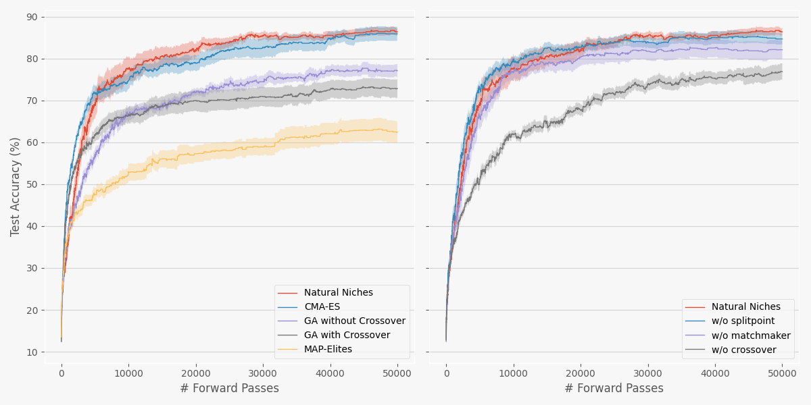

# Improving Model Merging with Natural Niches

This repository contains code for the paper: Improving Model Merging with Natural Niches. 

Using this repository you can reproduce the results in the image below, which shows that Natural Niches can achieve comparable results to CMA-ES when evolving MNIST classifiers from scratch.

## Install dependencies
