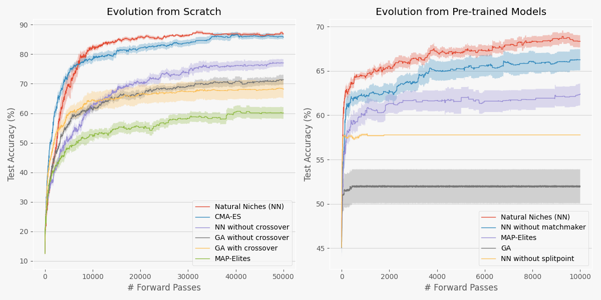

# Competition and Attraction Improve Model Fusion

This repository contains code for our GECCO paper: [Competition and Attraction Improve Model Fusion
](https://dl.acm.org/doi/abs/10.1145/3712256.3726329) ([arxiv](https://arxiv.org/abs/2508.16204)). 

Using this repository you can reproduce the results in the image below, which shows that M2N2 (<u>M</u>odel <u>M</u>erging with <u>N</u>atural <u>N</u>iches) can achieve comparable results to CMA-ES when evolving MNIST classifiers from scratch, and it is the best method to evolve pre-trained models.



## Table of Contents

- [Installation](#installation)
- [Running Experiments](#running-experiments)
- [Ablation Studies](#ablation-studies)
- [Displaying Results](#displaying-results)
- [Citation](#citation)


## Installation
```sh
conda env create -f environment.yml
```

This will create a new Conda environment named natural_niches with all required packages.


## Running experiments

### Activate the conda environment
```sh
conda activate natural_niches
```

### Running the different methods
You can run different methods by specifying the --method parameter. Replace <method> with one of the following options: `natural_niches`, `map_elites`, `cma_es`, or `ga`.
```sh
python main.py --method <method>
```

**Example:** Run the `ga` without crossover:

```sh
python main.py --method ga --no_crossover
```

### Running evolution from pre-trained models
The default is to run evolution from scratch. To start from pre-trained add the `--use_pre_trained` argument.

**Example:** Run the `map_elites` starting from pre-trained models:
```sh
python main.py --method map_elites --use_pre_trained
```


## Displaying results
To visualize the results, open the Jupyter notebook `plotting.ipynb` and run all the cells.

## Citation
If you use this code or the ideas from our paper, please cite our work:

```
@article{sakana2025m2n2,
  title={Competition and Attraction Improve Model Fusion},
  author={Abrantes, Jo\~{a}o and Lange, Robert and Tang, Yujin},
  booktitle={Proceedings of the 2025 genetic and evolutionary computation conference},
  pages={1217--1225},
  year={2025}
}
```
