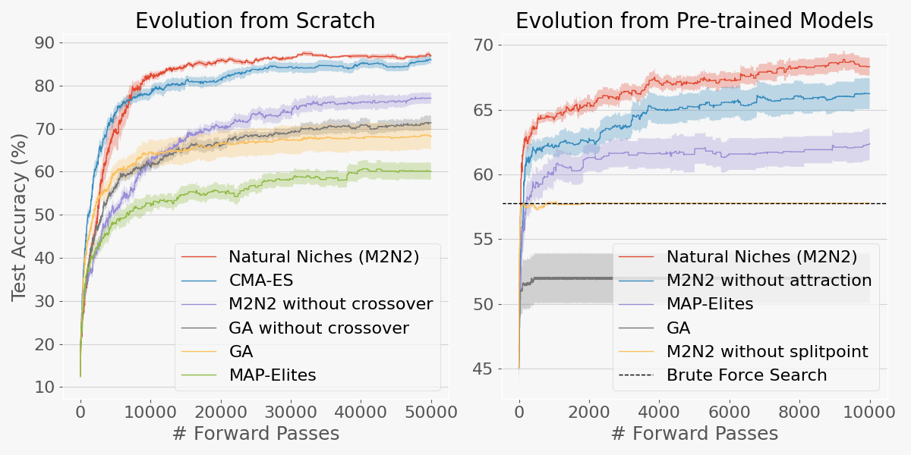

# Improving Model Merging with Natural Niches

This repository contains code for the paper: Improving Model Merging with Natural Niches. 

Using this repository you can reproduce the results in the image below, which shows that Natural Niches can achieve comparable results to CMA-ES when evolving MNIST classifiers from scratch.



## Table of Contents

- [Installation](#installation)
- [Running Experiments](#running-experiments)
- [Ablation Studies](#ablation-studies)
- [Displaying Results](#displaying-results)
- [Citation](#citation)


## Installation
```sh
conda env create -f environment.yml
```

This will create a new Conda environment named natural_niches with all required packages.


## Running experiments

### Activate the conda environment
```sh
conda activate natural_niches
```

### Running the different methods
You can run different methods by specifying the --method parameter. Replace <method> with one of the following options: `natural_niches`, `map_elites`, `cma_es`, or `ga`.
```sh
python main.py --method <method>
```

**Example:** Run the `ga` without crossover:

```sh
python main.py --method ga --no_crossover
```

## Ablation Studies

- **Without Crossover:**
```sh
python main.py --method natural_niches --no_crossover
```
- **Without Matchmaker:**
```sh
python main.py --method natural_niches --no_matchmaker
```
- **Without Split-point:**
```sh
python main.py --method natural_niches --no_splitpoint
```

## Displaying results
To visualize the results, open the Jupyter notebook `plotting.ipynb` and run all the cells.

## Citation
If you use this code or the ideas from our paper, please cite our work:

@article{paper,
  
}


